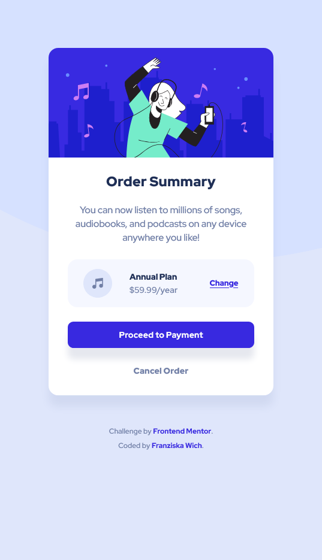

# Frontend Mentor - Order summary card solution

This is a solution to the [Order summary card challenge on Frontend Mentor](https://www.frontendmentor.io/challenges/order-summary-component-QlPmajDUj). Frontend Mentor challenges help you improve your coding skills by building realistic projects.

## Table of contents

- [Overview](#overview)
  - [The challenge](#the-challenge)
  - [Screenshot](#screenshot)
  - [Links](#links)
- [My process](#my-process)
  - [Built with](#built-with)
  - [What I learned](#what-i-learned)
  - [Useful resources](#useful-resources)
- [Author](#author)

## Overview

### The challenge

Users should be able to:

- See hover states for interactive elements

### Screenshot

### Links

- Solution URL: [https://github.com/franziskawich/order-summary-component](https://github.com/franziskawich/order-summary-component)
- Live Site URL: [https://franziskawich.github.io/order-summary-component/](https://franziskawich.github.io/order-summary-component/)

## My process

### Built with

- Semantic HTML5 markup
- CSS custom properties
- SCSS saved as CSS
- Flexbox
- BEM
- Mobile-first workflow

### What I learned

After a long break, I re-learned a lot with this little project. I wrote down some steps of my workflow, because it was a bit overwhelming how much I forgot during this break, and now I have a document to use when I get stuck and don't know what I usually do next. 🙂 I realized again that I have some problems with positioning background images. I played around with the zoom of different browsers to see what's really going on and read a few articles on MDN Web Docs about background CSS properties. I also re-read the BEM naming convention and flex properties, among other things.

### Useful resources

- [CSS-Tricks: Button vs. Links](https://css-tricks.com/buttons-vs-links/) - This helped me remember which HTML element, `<button>` or `<a href="">`, I should use in this scenario.

## Author

- Frontend Mentor - [@franziskawich](https://www.frontendmentor.io/profile/franziskawich)
- freeCodeCamp - [Franziska Wich](https://www.freecodecamp.org/franziska-wich)
